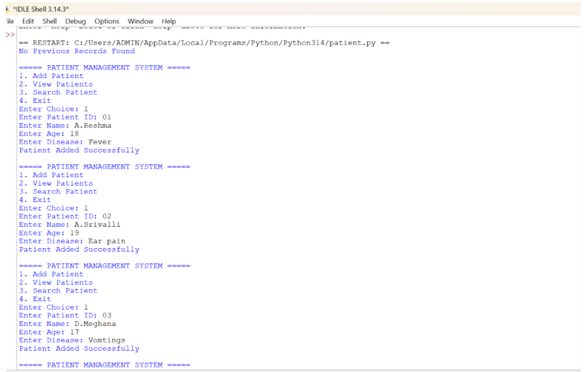
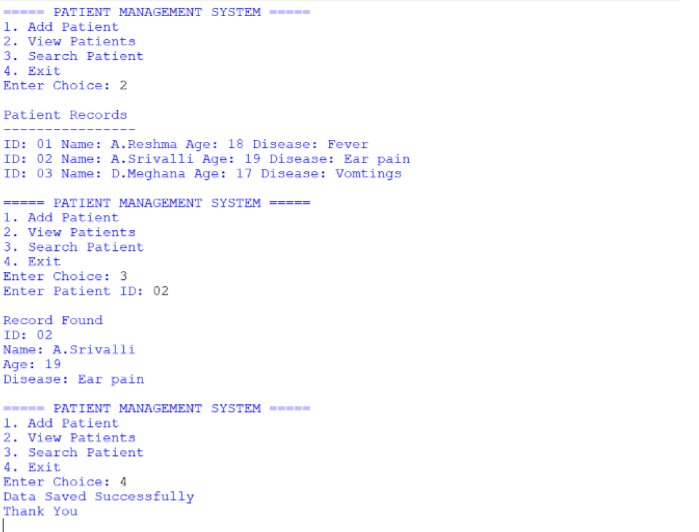

# 🏥 Patient Management System

> A simple and beginner-friendly **Python-based Patient Management System** for storing, viewing, searching, and saving patient records.

---

## 📌 Project Overview

The **Patient Management System** is a console-based Python application designed to make basic patient record management simple and organized.

The application allows users to:

- ➕ Add new patient records
- 👀 View all registered patients
- 🔎 Search for a patient using Patient ID
- 💾 Save patient records to a text file
- 📂 Load previously saved records automatically
- 🚪 Exit the application safely

The project demonstrates the use of **Python classes, dictionaries, file handling, loops, conditional statements, and user input**.

---

## 🎯 Main Agenda

The main objective of this project is to create a simple system that can:

1. Store patient information efficiently.
2. Provide an easy menu-driven interface.
3. Search patient records quickly using a unique Patient ID.
4. Preserve records using file handling.
5. Demonstrate basic **Object-Oriented Programming (OOP)** concepts in Python.

---

## ✨ Features

| Feature | Description |
|---|---|
| ➕ Add Patient | Adds a new patient using Patient ID, name, age, and disease |
| 📋 View Patients | Displays all available patient records |
| 🔍 Search Patient | Finds a patient using their Patient ID |
| 💾 Save Data | Stores records in `patients.txt` |
| 📂 Load Data | Loads previously saved records when the program starts |
| ⚠️ Error Handling | Displays a message when previous records are unavailable |
| 🖥️ Menu Driven | Easy-to-use command-line menu |

---

## 🧰 Technologies Used

- 🐍 **Python**
- 📦 **Object-Oriented Programming**
- 🗂️ **Python Dictionary**
- 📄 **Text File Handling**
- 🔁 **Loops & Conditional Statements**
- ⌨️ **Command-Line Interface (CLI)**

---

## 🏗️ Project Structure

```text
Patient-Management-System/
│
├── patient management.py
├── patients.txt
└── README.md
```

> `patients.txt` is created/updated by the program when patient data is saved.

---

## ⚙️ How the System Works

### 1️⃣ Add Patient

The user enters:

```text
Patient ID
Name
Age
Disease
```

The information is stored in the program's patient dictionary.

Example:

```text
Enter Patient ID: P101
Enter Name: Rahul
Enter Age: 25
Enter Disease: Fever

Patient Added Successfully
```

---

### 2️⃣ View Patients

The system displays all stored patient records.

Example:

```text
Patient Records

ID: P101
Name: Rahul
Age: 25
Disease: Fever
```

---

### 3️⃣ Search Patient

The user enters a **Patient ID**.

If the record exists, the system displays the patient's details.

```text
Enter Patient ID: P101

Record Found
ID: P101
Name: Rahul
Age: 25
Disease: Fever
```

If the ID does not exist:

```text
Patient Not Found
```

---

### 4️⃣ Save Patient Data

When the user chooses **Exit**, the program saves the patient records into:

```text
patients.txt
```

The data is stored in a simple comma-separated format:

```text
P101,Rahul,25,Fever
```

---

### 5️⃣ Load Previous Records

When the application starts, it attempts to load existing records from `patients.txt`.

If no previous file is available, the system displays:

```text
No Previous Records Found
```

---

## 🖥️ Application Menu

The main menu provides four options:

```text
===== PATIENT MANAGEMENT SYSTEM =====

1. Add Patient
2. View Patients
3. Search Patient
4. Exit

Enter Choice:
```

---

## 📸 Output Screenshots

Add your screenshots here after running the project.

### 🏠 Main Menu




---

## 🚀 How to Run

### Step 1: Install Python

Make sure Python is installed on your computer.

Check the installation:

```bash
python --version
```

### Step 2: Clone the Repository

```bash
git clone YOUR_GITHUB_REPOSITORY_URL
```

### Step 3: Open the Project Folder

```bash
cd Patient-Management-System
```

### Step 4: Run the Program

```bash
python "patient management.py"
```

### Step 5: Use the Menu

Choose an option by entering:

```text
1 → Add Patient
2 → View Patients
3 → Search Patient
4 → Exit
```

---

## 🧠 Concepts Demonstrated

This project is useful for learning fundamental Python programming concepts.

### 🔹 Object-Oriented Programming

The system is organized using a `PatientManagement` class.

### 🔹 Dictionary

Patient records are maintained using a Python dictionary, with the Patient ID acting as the key.

### 🔹 Functions / Methods

Separate methods handle different operations:

```text
add_patient()
view_patients()
search_patient()
save_data()
load_data()
```

### 🔹 File Handling

The project uses `patients.txt` to save and retrieve records.

### 🔹 Exception Handling

`FileNotFoundError` is handled when no previous patient file exists.

### 🔹 Loops and Conditions

A continuous menu loop allows the user to perform multiple operations until choosing Exit.

---

## 📊 Basic Workflow

```text
             ┌──────────────────────┐
             │       START          │
             └──────────┬───────────┘
                        ↓
             ┌──────────────────────┐
             │ Load Previous Data   │
             └──────────┬───────────┘
                        ↓
             ┌──────────────────────┐
             │    Display Menu      │
             └──────────┬───────────┘
                        ↓
          ┌─────────────┼─────────────┐
          ↓             ↓             ↓
      Add Patient   View Patients  Search Patient
          │             │             │
          └─────────────┼─────────────┘
                        ↓
                  Continue Menu
                        │
                        ↓
                     Exit
                        │
                        ↓
                Save Patient Data
                        │
                        ↓
                      END
```

---

## 🔐 Data Storage

Patient information is stored locally in a text file.

Example:

```text
P101,Rahul,25,Fever
P102,Priya,30,Cold
P103,Arun,45,Diabetes
```

> ⚠️ **Note:** This project is intended as an educational/demo application. It is not designed for storing real patient or other sensitive medical information in a production environment.

---

## 🔮 Future Improvements

The project can be extended with:

- ✏️ Update patient details
- 🗑️ Delete patient records
- 📅 Appointment management
- 👨‍⚕️ Doctor information
- 💊 Prescription management
- 🗄️ MySQL/SQLite database integration
- 🖼️ Graphical User Interface (GUI)
- 🔐 User login and authentication
- 📊 Patient reports and statistics
- 🌐 Web-based interface

---

## 👩‍💻 Author

**Hemapriya Tallapaneni**

If you found this project useful, consider giving the repository a ⭐!

---

## 📄 License

This project is created for **educational and learning purposes**.
